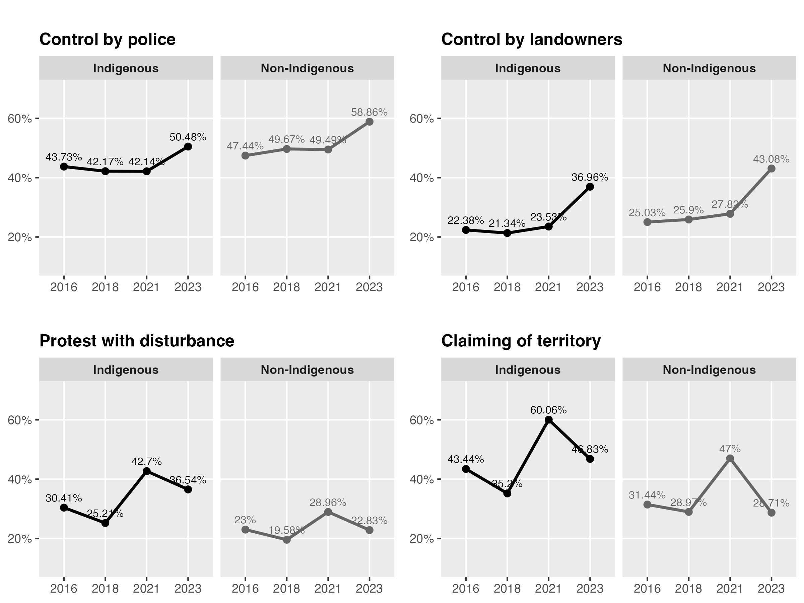
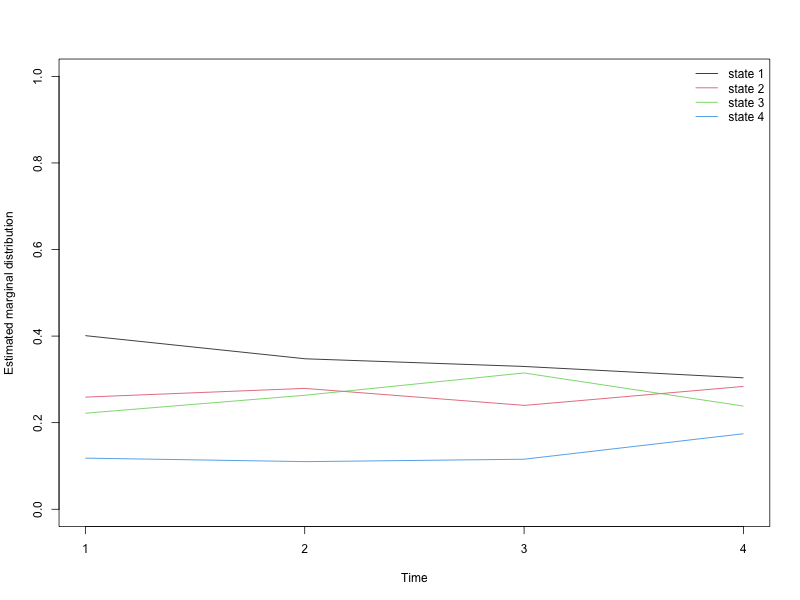
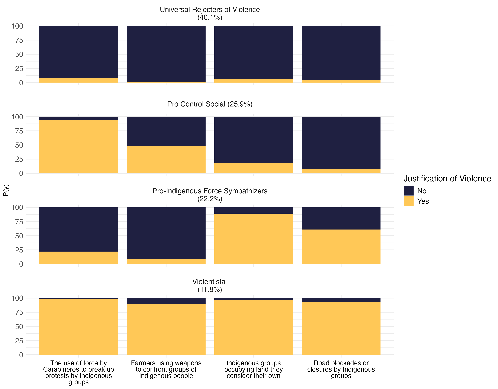
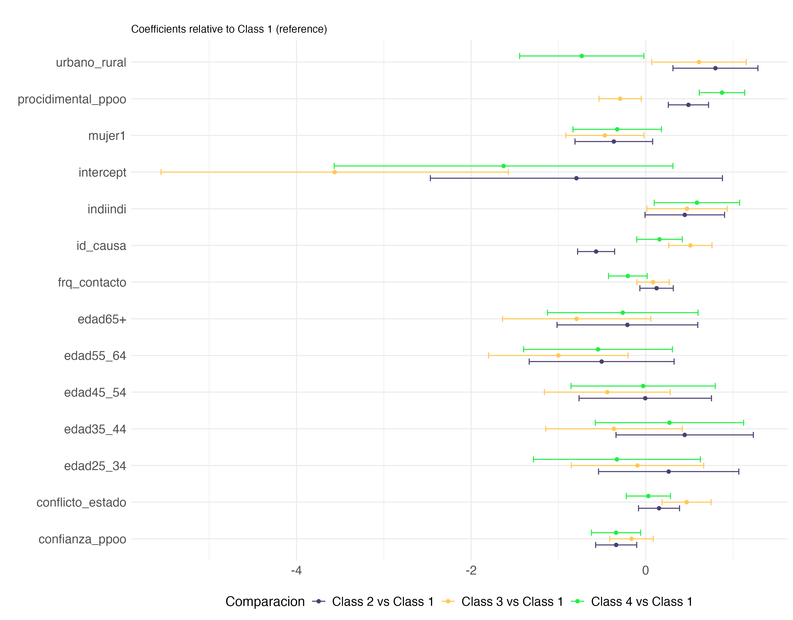
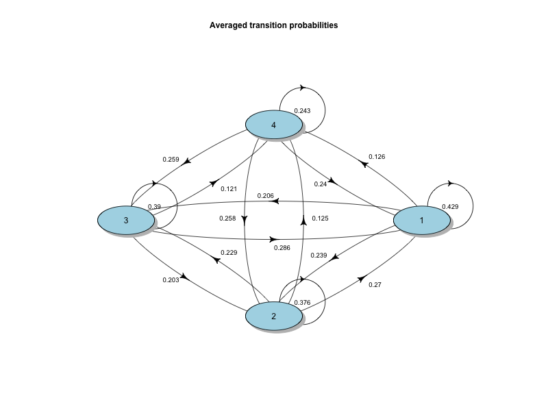
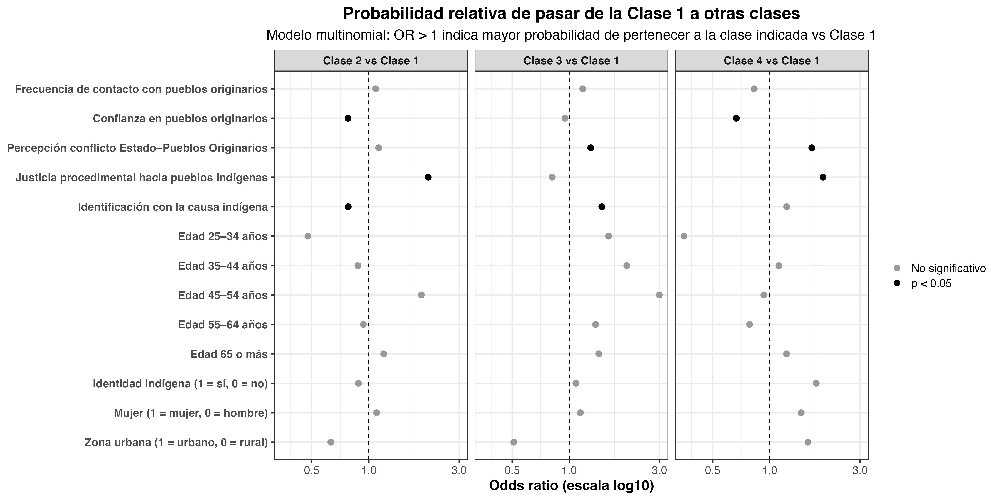

```{r}
library(tidyverse)
library(dplyr)
library(gt)
```

# Abstract

(Escribir más adelante.)

**Keywords:** conflicto interétnico, violencia intergrupal, legitimidad, justicia procedimental, Chile, análisis de clases latentes.

# 1. Introducción

*Responsable: Matías Deneken*

(Plantear pregunta central, contribución, relevancia empírica y teórica.)

El estudio del conflicto entre el Estado chileno y los pueblos indígenas—especialmente el pueblo mapuche—ha estado marcado por tensiones históricas, desigualdades estructurales y episodios recurrentes de violencia intergrupal. Sin embargo, existe limitada evidencia longitudinal sobre cómo cambian las actitudes hacia la violencia interétnica y qué factores sociales y psicológicos legitiman su uso. Este artículo aborda estas brechas mediante un diseño de clases latentes aplicado a cuatro olas de la Encuesta Longitudinal de Relaciones Interculturales (ELRI, 2016–2023).

# 2. Perspectiva teórica

## 2.1. El conflicto indígena en Chile

(Repaso histórico y político hasta el proceso constituyente.)

## 2.2. Relaciones intergrupales: contacto, confianza y legitimidad

(Enfocar en teorías de relaciones intergrupales, contacto, amenaza, confianza social.)

## 2.3. Justicia procedimental y violencia intergrupal

(Relacionar legitimidad institucional con apoyo a la violencia entre grupos.)

# 3. Métodos

## 3.1. Datos

Utilizamos la **Encuesta Longitudinal de Relaciones Interculturales (ELRI)**, un panel que sigue a personas indígenas y no indígenas entre 2016 y 2023.

## 3.2. Variables

### 3.2.1. Variable independiente principal

Clases latentes construidas a partir de cuatro indicadores:

-   Dos ítems asociados a **cambio social**.\
-   Dos ítems asociados a **control social**.

### 3.2.2. Variables dependientes

Cada modelo incluye como desenlaces:

-   Percepción de conflicto Estado–Pueblos Originarios\
-   Confianza en pueblos originarios\
-   Justicia procedimental hacia pueblos indígenas\
-   Identificación con la causa indígena\
-   Frecuencia de contacto\
-   Urbano/rural\
-   Mujer\
-   Identidad indígena (indi / no indi)\
-   Edad

(Se pueden agregar descriptivos en tabla.)

## 3.3. Técnica analítica

Se estimaron **modelos de clases latentes (Latent Class Analysis, LCA)** para identificar perfiles de legitimación de la violencia interétnica. Posteriormente, se modeló la probabilidad de pertenencia a cada clase como función de las variables dependientes mediante regresión logística multinomial o transición latente (dependiendo del diseño final).

### 3.X. Modelo estructural

#### 3.X.1 Distribución inicial de las clases latentes

Sea \(U_{it} \in \{1,\dots,K\}\) la clase latente del individuo \(i\) en el tiempo \(t\), y \(\mathbf{X}_i\) un vector de covariables individuales (por ejemplo, edad, género, identidad indígena, zona urbana/rural, confianza en pueblos originarios, percepción de conflicto, justicia procedimental e identificación con la causa indígena). 

La distribución inicial de las clases, en \(t = 1\), se modela mediante una regresión logística multinomial:

$$
P(U_{i1} = u \mid \mathbf{X}_i) \;=\; 
\frac{\exp\big(\alpha_u + \mathbf{X}_i^\top \boldsymbol{\beta}_u\big)}
     {\displaystyle \sum_{v=1}^{K} \exp\big(\alpha_v + \mathbf{X}_i^\top \boldsymbol{\beta}_v\big)},
\quad u = 1,\dots,K,
$$

donde \(\alpha_u\) es el intercepto específico de la clase \(u\) y \(\boldsymbol{\beta}_u\) es el vector de coeficientes asociado a las covariables \(\mathbf{X}_i\) para dicha clase. Una de las clases se toma como referencia para asegurar la identificación del modelo.

#### 3.X.2 Modelo de transición entre clases

Para estudiar la dinámica de las clases entre dos olas consecutivas, modelamos la probabilidad de transición desde una clase de origen \(v\) en \(t-1\) hacia una clase de destino \(u\) en \(t\), en función de las mismas covariables \(\mathbf{X}_i\). La estructura de transición se especifica también mediante un modelo logístico multinomial:

$$
P\big(U_{it} = u \mid U_{i,t-1} = v,\; \mathbf{X}_i\big)
\;=\;
\frac{\exp\big(\gamma_{vu} + \mathbf{X}_i^\top \boldsymbol{\delta}_{vu}\big)}
     {\displaystyle \sum_{w=1}^{K} \exp\big(\gamma_{vw} + \mathbf{X}_i^\top \boldsymbol{\delta}_{vw}\big)},
\quad u = 1,\dots,K,
$$

donde \(\gamma_{vu}\) es el intercepto de la transición desde la clase \(v\) hacia la clase \(u\), y \(\boldsymbol{\delta}_{vu}\) recoge el efecto de las covariables sobre dicha transición. En la práctica, estimamos razones de odds (odds ratios) para comparar la probabilidad de permanecer en la clase de referencia frente a la probabilidad de transitar a las otras clases, en función de las variables de contacto, confianza, percepción de conflicto, justicia procedimental, identificación con la causa indígena y características sociodemográficas.


# 4. Resultados

Descriptivos

{fig-align="center" width="402"}

**Primer resultado:** Clases y estabilidad de las mismas.

{fig-align="center"}

{fig-align="center"}

**Resultado 2:** Probabilidad de pertenencia de las clases

```{r, echo=FALSE}

predictores <- readRDS("tables/predictores.rds")
```

```{r tbl-predictores, message=FALSE, warning=FALSE, echo=FALSE}
## Tabla de predictores del modelo multinomial


# Construir columnas combinadas coeficiente+IC y OR+IC
predictores_tab <- predictores |>
  mutate(
    Coef_IC = sprintf("%.3f [%.3f, %.3f]", Coeficiente, IC_lower, IC_upper),
    OR_IC   = sprintf("%.2f [%.2f, %.2f]", OR, OR_IC_lower, OR_IC_upper),
    significativo  = ifelse(significativo, "Sí (p < .05)", "No")
  ) |>
  select(
    Variable,
    Comparacion,
    Coef_IC,
    OR_IC,
    significativo
  ) |>
  arrange(Variable, Comparacion)

tbl_predictores <- predictores_tab |>
  gt() |>
  tab_header(
    title = md("**Predictores de pertenencia entre clases latentes**"),
    subtitle = "Coeficientes y odds ratios (OR) del modelo de regresión multinomial"
  ) |>
  cols_label(
    Variable    = "Variable",
    Comparacion = "Comparación",
    Coef_IC     = "Coeficiente (IC 95%)",
    OR_IC       = "OR (IC 95%)",
    significativo      = "significativoicativo"
  ) |>
  tab_options(
    table.font.size = px(12),
    data_row.padding = px(2)
  ) |>
  tab_style(
    style = cell_text(weight = "bold"),
    locations = cells_column_labels(everything())
  ) |>
  tab_style(
    style = cell_fill(color = "#e6f4ea"),
    locations = cells_body(
      columns = significativo,
      rows = significativo == "Sí (p < .05)"
    )
  )

tbl_predictores

```

{fig-align="center"}

**Resultado 3: Probabilidad de cambiarse de clase**

{fig-align="center"}

```{r tbl-transiciones, message=FALSE, warning=FALSE}
library(readxl)
coes <- read_excel("tables/coef_transiciones_odds.xlsx")


library(dplyr)
library(gt)

# coes: tibble con columnas:
# Variable, odds1_2, pvalue1_2, odds1_3, pvalue1_3, odds1_4, pvalue1_4

trans_tab <- coes |>
  # si no quieres mostrar el intercept en la tabla, descomenta la siguiente línea:
  # filter(Variable != "intercept") |>
  mutate(
    sig2 = pvalue1_2 < 0.05,
    sig3 = pvalue1_3 < 0.05,
    sig4 = pvalue1_4 < 0.05
  ) |>
  select(
    Variable,
    odds1_2, pvalue1_2,
    odds1_3, pvalue1_3,
    odds1_4, pvalue1_4,
    sig2, sig3, sig4
  )

gt_trans <- trans_tab |>
  gt() |>
  tab_header(
    title = md("**Odds ratio de transición desde la Clase 1**"),
    subtitle = "Probabilidad relativa de pasar a las Clases 2, 3 y 4 (ref. = Clase 1)"
  ) |>
  cols_label(
    Variable   = "Variable",
    odds1_2    = "OR Clase 2 vs 1",
    pvalue1_2  = "p",
    odds1_3    = "OR Clase 3 vs 1",
    pvalue1_3  = "p",
    odds1_4    = "OR Clase 4 vs 1",
    pvalue1_4  = "p"
  ) |>
  tab_spanner(
    label = "Transición a Clase 2",
    columns = c(odds1_2, pvalue1_2)
  ) |>
  tab_spanner(
    label = "Transición a Clase 3",
    columns = c(odds1_3, pvalue1_3)
  ) |>
  tab_spanner(
    label = "Transición a Clase 4",
    columns = c(odds1_4, pvalue1_4)
  ) |>
  fmt_number(
    columns = c(odds1_2, odds1_3, odds1_4),
    decimals = 2
  ) |>
  fmt_number(
    columns = c(pvalue1_2, pvalue1_3, pvalue1_4),
    decimals = 3
  ) |>
  tab_options(
    table.font.size = px(12),
    data_row.padding = px(3)
  ) |>
  tab_style(
    style = cell_text(weight = "bold"),
    locations = cells_column_labels(everything())
  ) |>
  # resaltar en verde claro los OR significativos (p < 0.05)
  tab_style(
    style = cell_fill(color = "#e6f4ea"),
    locations = cells_body(
      columns = odds1_2,
      rows = sig2
    )
  ) |>
  tab_style(
    style = cell_fill(color = "#e6f4ea"),
    locations = cells_body(
      columns = odds1_3,
      rows = sig3
    )
  ) |>
  tab_style(
    style = cell_fill(color = "#e6f4ea"),
    locations = cells_body(
      columns = odds1_4,
      rows = sig4
    )
  ) |>
  cols_hide(c(sig2, sig3, sig4))

gt_trans


```

{fig-align="center"}

# 5. Discusión

(Por completar: implicancias teóricas, políticas, contribuciones al estudio del conflicto indígena.)

# 6. Conclusión

(Por completar.)

# Referencias

(Agregar luego con pandoc csl.)
